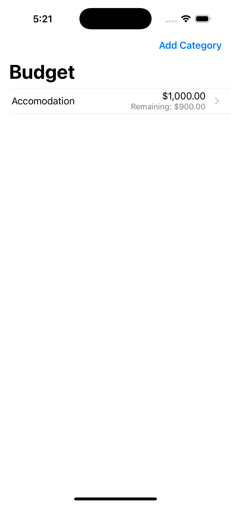
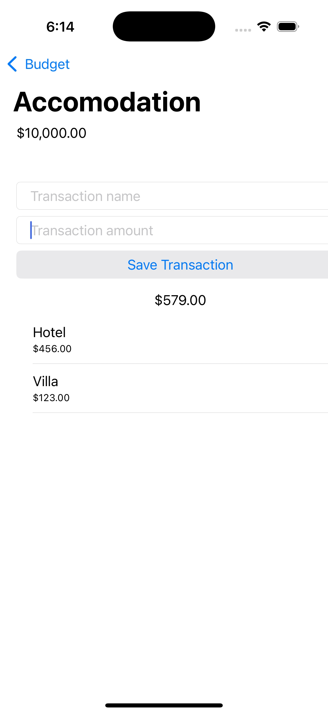

# 💰 Budget Tracker iOS App
A simple and intuitive iOS app that helps users track their spending by category and manage their remaining budget effectively.

## 📱 Overview

This app allows users to:

- Create budget **categories** (e.g., Accomodation, Food, Transport)
- Add **transactions** under each category (e.g., Hotel - $456, Villa - $123)
- View total **amount spent** and **remaining budget** per category
- Maintain an organized record of spending habits with a clean and user-friendly interface

## 🖼️ App Screenshot
|  |  |
|:--:|:--:|
| Budget Overview | Add Transactions |

## 🧩 Features

- Create budget categories  
- Add one or more transactions to each category  
- Automatically calculate and display the total amount spent  
- Show remaining budget based on initial amount  
- Clean and minimalistic UI design  

## 🛠️ Tech Stack

- **Language**: Swift  
- **Framework**: UIKit  
- **Data Storage**: Core Data  
- **Platform**: iOS  
- **Minimum iOS Version**: iOS 13.0  